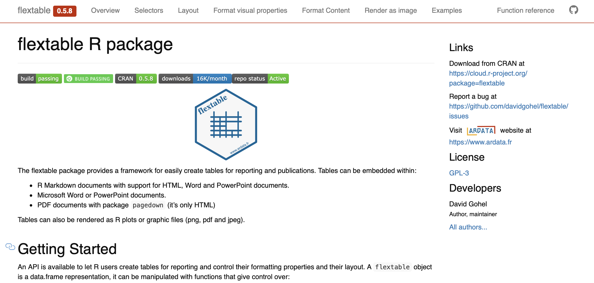
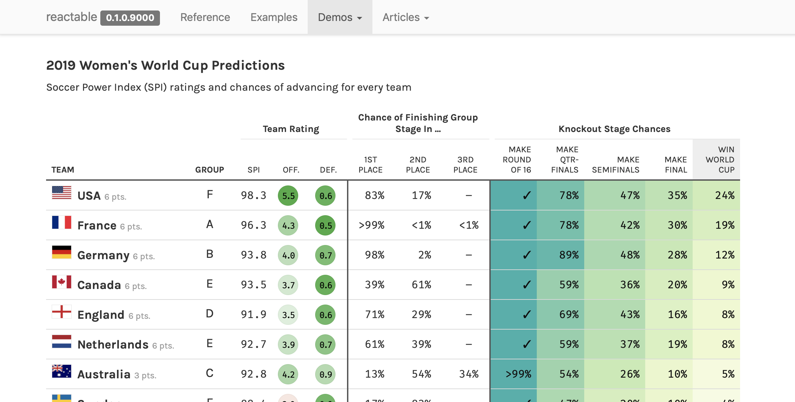
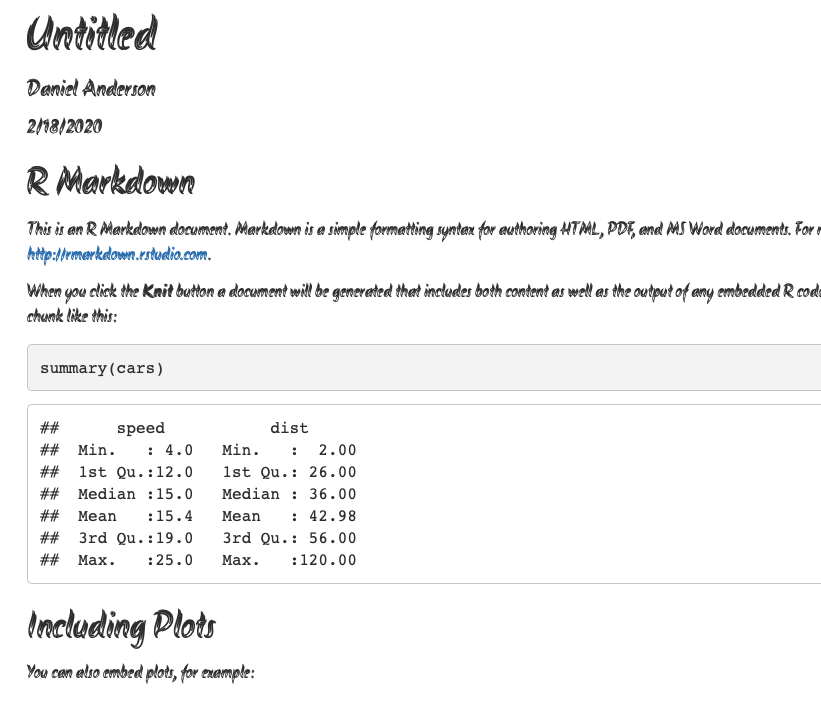
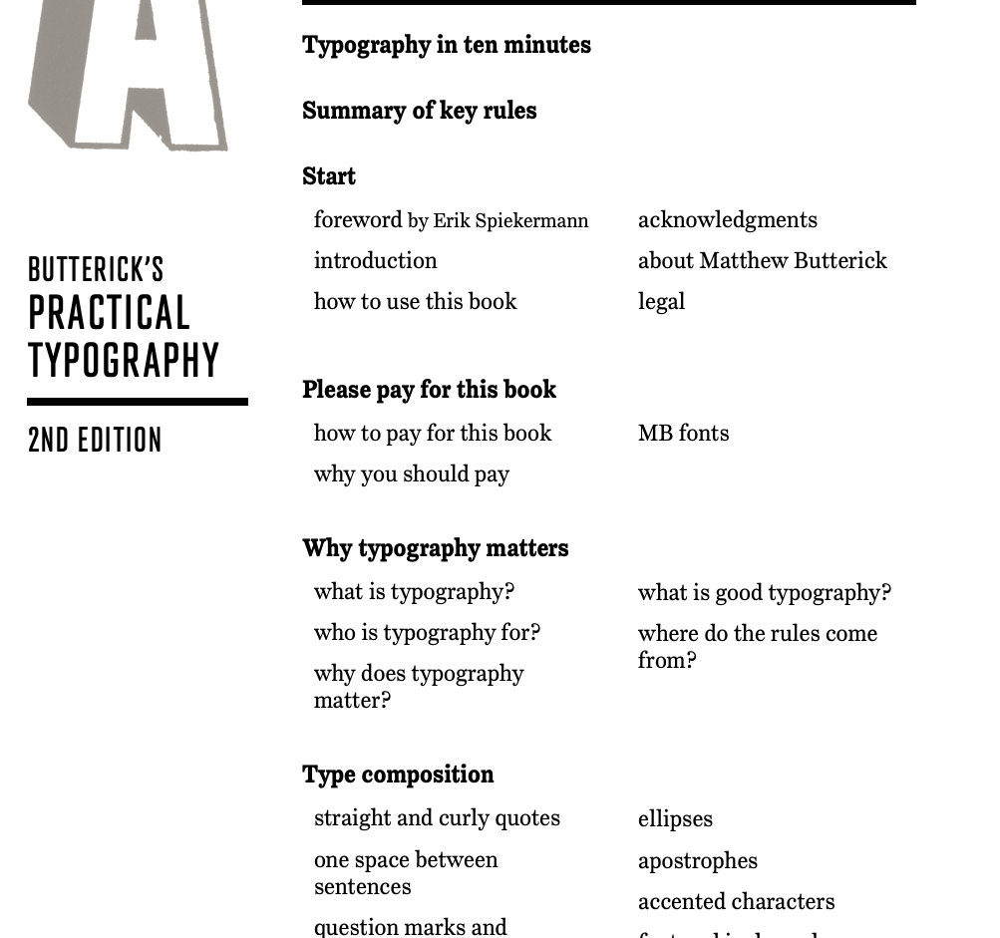

```{r setup, include = FALSE}
knitr::opts_chunk$set(dev = "CairoPNG",
                      fig.width = 13, 
                      message = FALSE, 
                      warning = FALSE,
                      echo = TRUE)

library(tidyverse)
library(dviz.supp)
theme_set(theme_minimal(25))

#source(here::here("resources", "wilke-redundant_coding.R"))
#source(here::here("resources", "wilke-proportions.R"))

update_geom_defaults('path', list(size = 3))
update_geom_defaults('point', list(size = 4))
#update_geom_defaults('text_repel', list(size = 6))
update_geom_defaults('text', list(size = 6))
```

# Agenda 
* Tables with `gt`
* Fonts with `showtext` and/or `extrafont`


--
### Learning objectives
* Be comfortable with the basics of `gt`
  + create a table
  + format columns
  + create spanner heads
  + etc.
* Understand how to use additional fonts (if you so choose)

---
class: inverse
background-image:url(https://github.com/rstudio/gt/raw/master/man/figures/logo.svg?sanitize=TRUE)
background-size: contain

---
# Overview
* New package (still very actively under development) by RStudio

* Really promising
  + Pipe-oriented
  + Beautiful tables easy
  + Spanner heads/grouping used to be a total pain - not so anymore
  + Renders to HTML/PDF without even thinking abou tit

* Has a few limitations relative to {papaja}

* May run into bumps because of the active development

---
# Install

```{r install-gt, eval = FALSE}
remotes::install_github("rstudio/gt")
```

---
# The hard part
* Getting your data in the format you want a table in

* Utilize your `pivot_*` skills regularly

```{r flying}
library(fivethirtyeight)
flying
```

---
```{r flying2}
smry <- flying %>% 
  count(gender, age, recline_frequency) %>% 
  drop_na(age,recline_frequency) %>% 
  pivot_wider(names_from = "age", 
              values_from = "n") 

smry
```


---
# Turn into table
### Disclaimer 
These all look slightly different on the slides

.pull-left[
```{r gt1-echo, eval = FALSE}
library(gt)
smry %>% 
  gt()
```
]


.pull-right[
```{r gt1-eval, echo = FALSE}
library(gt)
smry %>% 
  gt()
```
]

---
## Add gender as a grouping variable

.pull-left[
```{r gt2-echo, eval = FALSE}
smry %>% 
  group_by(gender) %>% #<<
  gt()
```
]

.pull-right[
```{r gt2-eval, echo = FALSE}
smry %>% 
  group_by(gender) %>% 
  gt()
```
]

---
# Add a spanner head

```{r gt3-echo, eval = FALSE}
smry %>% 
  group_by(gender) %>% 
  gt() %>% 
  tab_spanner(label = "Age Range", #<<
              columns = vars(`18-29`, `30-44`, `45-60`, `> 60`)) #<<
```

---
```{r gt3-eval, echo = FALSE}
smry %>% 
  group_by(gender) %>% 
  gt() %>% 
  tab_spanner(label = "Age Range",
              columns = vars(`18-29`, `30-44`, `45-60`, `> 60`))
```

---
# Change column names

```{r gt4-echo, eval = FALSE}
smry %>% 
  group_by(gender) %>% 
  gt() %>% 
  tab_spanner(label = "Age Range",
              columns = vars(`18-29`, `30-44`, `45-60`, `> 60`)) %>% 
  cols_label(recline_frequency = "Recline") #<<
```

---
```{r gt4-eval, echo = FALSE}
smry %>% 
  group_by(gender) %>% 
  gt() %>% 
  tab_spanner(label = "Age Range",
              columns = vars(`18-29`, `30-44`, `45-60`, `> 60`)) %>% 
  cols_label(recline_frequency = "Recline")
```

---
# Align columns

```{r gt4-aligned-echo, eval = FALSE}
smry %>% 
  group_by(gender) %>% 
  gt() %>% 
  tab_spanner(label = "Age Range",
              columns = vars(`18-29`, `30-44`, `45-60`, `> 60`)) %>% 
  cols_label(recline_frequency = "Recline") %>% 
  cols_align(align = "left", columns = vars(recline_frequency)) #<<
```

---
```{r gt4-aligned-eval, echo = FALSE}
smry %>% 
  group_by(gender) %>% 
  gt() %>% 
  tab_spanner(label = "Age Range",
              columns = vars(`18-29`, `30-44`, `45-60`, `> 60`)) %>% 
  cols_label(recline_frequency = "Recline") %>% 
  cols_align(align = "left", columns = vars(recline_frequency))
```

---
# Add a title

```{r gt4-title-echo, eval = FALSE}
smry %>% 
  group_by(gender) %>% 
  gt() %>% 
  tab_spanner(label = "Age Range",
              columns = vars(`18-29`, `30-44`, `45-60`, `> 60`)) %>% 
  cols_label(recline_frequency = "Recline") %>% 
  cols_align(align = "left", columns = vars(recline_frequency)) %>% 
  tab_header(title = "Airline Passengers", #<<
             subtitle = "Leg space is limited, what do you do?") #<<
```

---
```{r gt4-title-eval, echo = FALSE}
smry %>% 
  group_by(gender) %>% 
  gt() %>% 
  tab_spanner(label = "Age Range",
              columns = vars(`18-29`, `30-44`, `45-60`, `> 60`)) %>% 
  cols_label(recline_frequency = "Recline") %>% 
  cols_align(align = "left", columns = vars(recline_frequency)) %>% 
  tab_header(title = "Airline Passengers",
             subtitle = "Leg space is limited, what do you do?")
```

---
# Format columns

```{r gt5-echo, eval = FALSE}
smry %>% 
  mutate_at(vars(`18-29`, `30-44`, `45-60`, `> 60`), ~./100) %>% #<<
  group_by(gender) %>% 
  gt() %>% 
  tab_spanner(label = "Age Range",
              columns = vars(`18-29`, `30-44`, `45-60`, `> 60`)) %>% 
  fmt_percent(vars(`18-29`, `30-44`, `45-60`, `> 60`), #<<
              decimals = 0) %>% #<<
  cols_label(recline_frequency = "Recline") %>% 
  cols_align(align = "left", columns = vars(recline_frequency)) %>% 
  tab_header(title = "Airline Passengers",
             subtitle = "Leg space is limited, what do you do?")
```

---
```{r gt5-eval, echo = FALSE}
smry %>% 
  mutate_at(vars(`18-29`, `30-44`, `45-60`, `> 60`), ~./100) %>% 
  group_by(gender) %>% 
  gt() %>% 
  tab_spanner(label = "Age Range",
              columns = vars(`18-29`, `30-44`, `45-60`, `> 60`)) %>% 
  fmt_percent(vars(`18-29`, `30-44`, `45-60`, `> 60`),
              decimals = 0) %>% 
  cols_label(recline_frequency = "Recline") %>% 
  cols_align(align = "left", columns = vars(recline_frequency)) %>% 
  tab_header(title = "Airline Passengers",
             subtitle = "Leg space is limited, what do you do?")
```

---
# Add a source note

```{r gt6-echo, eval = FALSE}
smry %>% 
  mutate_at(vars(`18-29`, `30-44`, `45-60`, `> 60`), ~./100) %>% 
  group_by(gender) %>% 
  gt() %>% 
  tab_spanner(label = "Age Range",
              columns = vars(`18-29`, `30-44`, `45-60`, `> 60`)) %>% 
  fmt_percent(vars(`18-29`, `30-44`, `45-60`, `> 60`),
              decimals = 0) %>% 
  cols_label(recline_frequency = "Recline") %>% 
  cols_align(align = "left", columns = vars(recline_frequency)) %>% 
  tab_header(title = "Airline Passengers",
             subtitle = "Leg space is limited, what do you do?") %>% 
  tab_source_note(source_note = md("Data from [fivethirtyeight](https://fivethirtyeight.com/features/airplane-etiquette-recline-seat/)")) #<<
```

---
```{r gt6-eval, echo = FALSE}
smry %>% 
  mutate_at(vars(`18-29`, `30-44`, `45-60`, `> 60`), ~./100) %>% 
  group_by(gender) %>% 
  gt() %>% 
  tab_spanner(label = "Age Range",
              columns = vars(`18-29`, `30-44`, `45-60`, `> 60`)) %>% 
  fmt_percent(vars(`18-29`, `30-44`, `45-60`, `> 60`),
              decimals = 0) %>% 
  cols_label(recline_frequency = "Recline") %>% 
  cols_align(align = "left", columns = vars(recline_frequency)) %>% 
  tab_header(title = "Airline Passengers",
             subtitle = "Leg space is limited, what do you do?") %>% 
  tab_source_note(source_note = md("Data from [fivethirtyeight](https://fivethirtyeight.com/features/airplane-etiquette-recline-seat/)"))
```

---
# Color cells
```{r gt7-echo, eval = FALSE}
smry %>% 
  mutate_at(vars(`18-29`, `30-44`, `45-60`, `> 60`), ~./100) %>% 
  group_by(gender) %>% 
  gt() %>% 
  tab_spanner(label = "Age Range",
              columns = vars(`18-29`, `30-44`, `45-60`, `> 60`)) %>% 
  fmt_percent(vars(`18-29`, `30-44`, `45-60`, `> 60`),
              decimals = 0) %>% 
  cols_label(recline_frequency = "Recline") %>% 
  data_color(vars(`18-29`, `30-44`, `45-60`, `> 60`), #<<
             colors = scales::col_numeric(palette = c(c("#FFFFFF", "#FF0000")), domain = NULL)) %>% #<<
  cols_align(align = "left", columns = vars(recline_frequency)) %>% 
  tab_header(title = "Airline Passengers",
             subtitle = "Leg space is limited, what do you do?") %>% 
  tab_source_note(source_note = md("Data from [fivethirtyeight](https://fivethirtyeight.com/features/airplane-etiquette-recline-seat/)"))
```

---
```{r gt7-eval, echo = FALSE}
smry %>% 
  mutate_at(vars(`18-29`, `30-44`, `45-60`, `> 60`), ~./100) %>% 
  group_by(gender) %>% 
  gt() %>% 
  tab_spanner(label = "Age Range",
              columns = vars(`18-29`, `30-44`, `45-60`, `> 60`)) %>% 
  fmt_percent(vars(`18-29`, `30-44`, `45-60`, `> 60`),
              decimals = 0) %>% 
  cols_label(recline_frequency = "Recline") %>% 
  data_color(vars(`18-29`, `30-44`, `45-60`, `> 60`),
             colors = scales::col_numeric(palette = c(c("#FFFFFF", "#FF0000")), domain = NULL)) %>% 
  cols_align(align = "left", columns = vars(recline_frequency)) %>% 
  tab_header(title = "Airline Passengers",
             subtitle = "Leg space is limited, what do you do?") %>% 
  tab_source_note(source_note = md("Data from [fivethirtyeight](https://fivethirtyeight.com/features/airplane-etiquette-recline-seat/)"))
```

---
# What else?
* Lots more it can do, and lots more in development
* See the [website](https://gt.rstudio.com)

--
* gtcars case study is worth going through

.pull-right[

]

---
class: inverse center middle

# A few other table options

---
# kableExtra
* Much more established
* Still really flexible
* Still mostly works with piping
* Renders in [pdf](https://haozhu233.github.io/kableExtra/awesome_table_in_pdf.pdf) or [html](https://cran.r-project.org/web/packages/kableExtra/vignettes/awesome_table_in_html.html)
* Probably the best option currently, but I think {gt} will be the way to go moving forward

---
# A few quick examples
Make sure to specify `results = "asis"` in your chunk options.

```{r kableExtra1, results = "asis"}
library(knitr)
library(kableExtra)
dt <- mtcars[1:5, 1:6]
kable(dt) %>%
  kable_styling("striped") %>%
  column_spec(5:7, bold = TRUE)
```

---
```{r kableExtra2, results = "asis"}
kable(dt) %>%
  kable_styling("striped") %>%
  column_spec(5:7, bold = TRUE) %>% 
  row_spec(c(2, 4), 
           bold = TRUE, 
           color = "#EFF3F7", 
           background = "#71B0DE")
```

---
```{r kableExtra3, results = "asis"}
kable(dt) %>%
  kable_styling("striped", full_width = F) %>%
  pack_rows("Group 1", 1, 3, 
            label_row_css = "background-color: #666; color: #fff;") %>% 
  pack_rows("Group 2", 4, 5, 
             label_row_css = "background-color: #666; color: #fff;")
```


---
# KableExtra wrapup
Many other options, please see the documentation. Works well for PDF and HTML.

--
What about Microsoft Word?

---
# flextable

[](https://davidgohel.github.io/flextable/index.html)

---
# reactable

[](https://glin.github.io/reactable/index.html)

---
# Many others
* [huxtable](https://hughjonesd.github.io/huxtable/)
* [formattable](https://renkun-ken.github.io/formattable/)
* [DT](https://rstudio.github.io/DT/) (particularly helpful when using [shiny](https://shiny.rstudio.com))
* [rhandsontable](https://jrowen.github.io/rhandsontable/)


--
### Particularly helpful for modeling
* [stargazer](https://www.jakeruss.com/cheatsheets/stargazer/)
* [pixiedust](https://github.com/nutterb/pixiedust)
* [modelsummary](https://github.com/vincentarelbundock/modelsummary)


--
### For descriptives
* [gtsummary](https://github.com/ddsjoberg/gtsummary)

---
class:inverse center middle
# Fonts

---
# General advice
* Use different fonts to distinguish things 
    + Specifically code
    + Consider different fonts for different heading levels, and/or to distinguish headers from the body

* .bolder[Always] choose a sans-serif font for code

* Explore and try - it makes a big impact on the overall look/feel (bigger than
you may expect if you haven't played with fonts much before)

* Try not to get sucked into too deep of a rabbit hole

---
# Google fonts

https://fonts.google.com

* Open source, designed for the web

* Good place to explore fonts

* Can be incorporated via the `{showtext}` package!

---
# {showtext} example

```{r showtext1-echo, eval = FALSE}
devtools::install_github("yixuan/showtext")

library(showtext)

font_add_google('Monsieur La Doulaise', "mld")
font_add_google('Special Elite', "se")

showtext_auto()
quartz()

ggplot(mtcars, aes(disp, mpg)) +
  geom_point() + 
  labs(title = "An amazing title", 
       subtitle = "with the world's most boring dataset") + 
  theme(plot.subtitle = element_text(size = 18, family = "se"), #<<
        plot.title = element_text(size = 22, family = "mld"), #<<
        axis.title = element_text(size = 18, family = "mld"), #<<
        axis.text.x = element_text(size = 12, family = "se"), #<<
        axis.text.y = element_text(size = 12, family = "se")) #<<
```


---
background-image:url("w7p2_files/figure-html/font-change.png")
background-size: contain


---
# extrafont
* Primary downside - you have to have the fonts installed on your computer
* Look at the install documentation - it's pretty good and fairly comprehensive

--
```{r extrafont-list}
library(extrafont)
# font_import() Only need to run once
fonts() # list fonts
```


---
```{r extrafont-plot-eval, echo = FALSE}
p <- ggplot(mtcars, aes(wt, mpg)) + 
  geom_point() +
  labs(title = "Fuel Efficiency of 32 Cars",
       x = "Weight (x1000 lb)",
       y = "Miles per Gallon") +
  theme(text = element_text(family = "Luminari", size = 30)) #<<

ggsave(here::here("slides", "w7p2_files", "figure-html", "luminari-font.png"), 
       p,
       height = 5.5)
```

```{r extrafont-plot, eval = FALSE, fig.height = 5}
ggplot(mtcars, aes(wt, mpg)) + 
  geom_point() +
  labs(title = "Fuel Efficiency of 32 Cars",
       x = "Weight (x1000 lb)",
       y = "Miles per Gallon") +
  theme(text = element_text(family = "Luminari", size = 30)) #<<
```

`)

---
class: inverse center middle
# Why fonts matter
### A few examples of epic fails
h/t [Will Chase](https://twitter.com/W_R_Chase)

---
# Megaflicks

.center[

]

---
background-image: url(https://i.redd.it/38jjcgaqu1g11.jpg)

---
background-image: url(img/always-mine.png)

---
# Quick aside
### Change the font of your R Markdown!

Create a new text file, import the text there, write a tiny bit of css.

```{css, eval = FALSE}
@import url('https://fonts.googleapis.com/css?family=Akronim&display=swap');

body {
  font-family: 'Akronim', cursive;
}
```

---
# Modify Rmd YAML
You need to have the CSS file in the same directory as your Rmd, then reference it with 

```
output: 
  html_document:
    css: custom.css
```

Here I'm assuming the file you saved before is called "custom.css".

---
# Render!



---
# Resource for learning more
* I'm not an expert on fonts. I have mostly just picked what looks nice to me.

--

### off down the rabbit hole again

.center[

```{r, out.width = "475px", echo = FALSE}
knitr::include_graphics("https://www.exopermaculture.com/wp-content/uploads/2013/01/alice-falling-down-rabbit-hole1.jpeg")
```

]

---
Best I've heard of is [practical typography](https://practicaltypography.com)


---
# Next time
Create your own blog!